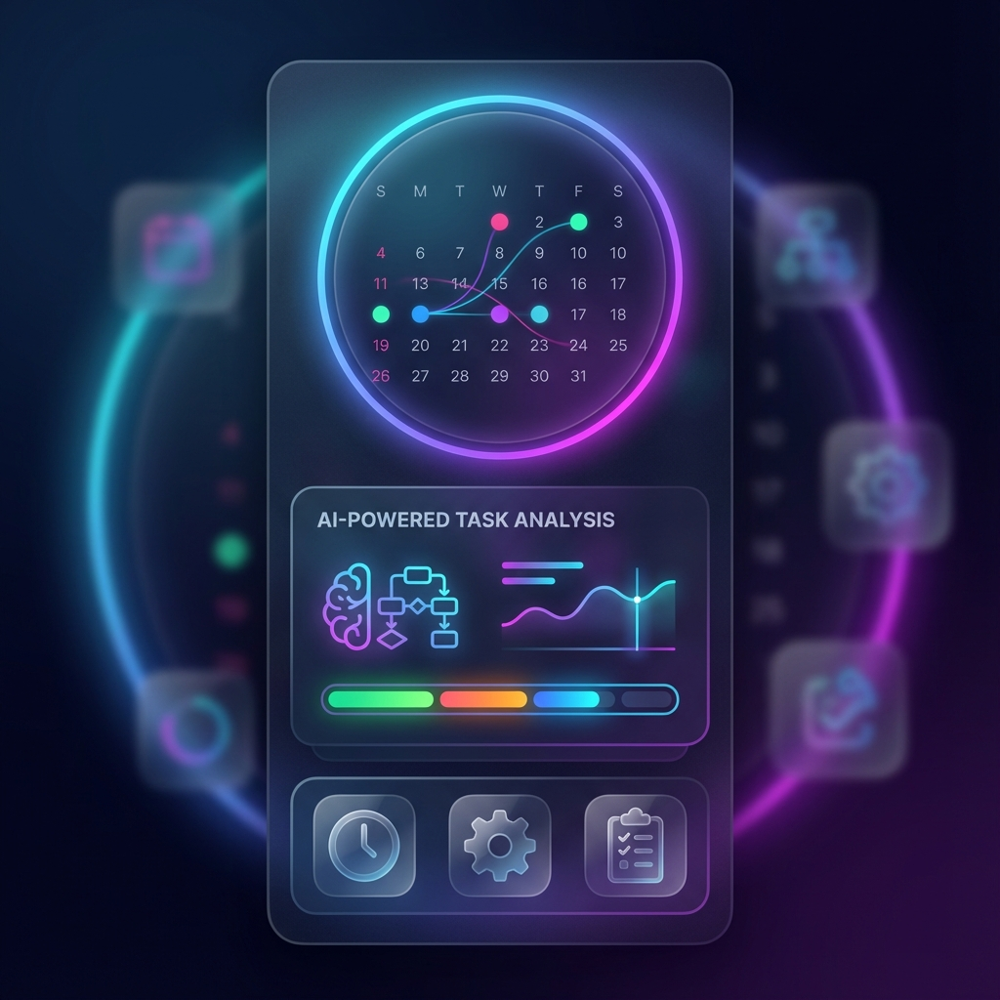

# 个人技能展示页

这是一个全面展示我个人技术栈、项目经历和专业技能的作品集网站。

## 项目概述

该作品集网站旨在展示我的技术能力、过往项目和专业经验，使用现代化的前端技术构建，具有响应式设计，适配各种设备。

## 技术栈

### 前端开发
- **框架**: Next.js 14 (App Router)
- **语言**: TypeScript
- **样式**: Tailwind CSS
- **图标**: Lucide React
- **字体**: Google Fonts via next/font

### 后端与部署
- **部署平台**: Vercel, EdgeOne
- **版本控制**: Git

## 核心项目

### 1. AI 日程安排应用
- **技术栈**: React Native, Python, Machine Learning
- **功能**: 智能日程规划、自然语言处理、个性化推荐
- **预览**: 

### 2. ESP32 监控系统
- **技术栈**: Embedded C, ESP32, MQTT, React
- **功能**: 实时数据监控、远程控制、数据可视化
- **预览**: 

### 3. 个人作品集网站
- **技术栈**: Next.js, TypeScript, Tailwind CSS
- **功能**: 响应式设计、项目展示、技能展示、联系表单
- **源码**: [wpenga-portfolio](wpenga-portfolio/)

## 专业技能

### 编程语言
- JavaScript/TypeScript
- Python
- Embedded C
- React Native
- SwiftUI

### 框架与库
- Next.js
- React
- Vue.js
- Svelte
- Flutter

### 工具与平台
- Git & GitHub
- Vercel
- Docker
- AWS
- Arduino/ESP32

## 部署说明

### 快速部署到 Vercel

点击下方按钮一键部署到 Vercel：

[](https://vercel.com/new/clone?repository-url=https%3A%2F%2Fgithub.com%2Fyourusername%2Fportfolio&env=API_KEY&envDescription=Required%20API%20keys%20for%20the%20application)

### 本地开发

1. 克隆仓库
   ```bash
   git clone https://github.com/yourusername/portfolio.git
   cd portfolio/wpenga-portfolio
   ```

2. 安装依赖
   ```bash
   npm install
   ```

3. 启动开发服务器
   ```bash
   npm run dev
   ```

4. 在浏览器中打开 [http://localhost:3000](http://localhost:3000)

## 项目结构

```
portfolio/
├── wpenga-portfolio/          # Next.js 作品集网站
│   ├── public/               # 静态资源
│   ├── src/                  # 源代码
│   │   ├── app/              # App Router 页面
│   │   └── components/       # 组件
│   └── package.json          # 依赖配置
├── ai_schedule_app_preview.png  # 项目预览图
├── esp32_monitor_preview.png     # 项目预览图
└── README.md                  # 项目说明
```

## 联系信息

- **GitHub**: [@yourusername](https://github.com/yourusername)
- **LinkedIn**: [yourname](https://linkedin.com/in/yourname)
- **Email**: your.email@example.com

## 许可证

MIT License
